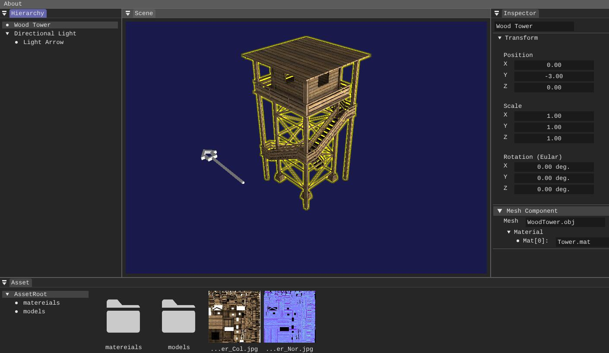

# Realtime Lab Renderer

This is an open-source toy renderer based on DirectX12 in an early development stage. The project plan could be seen [here](https://github.com/liubai01/Realtime-Lab/projects/1).

**Latest version**: Alpha v0.0.1

### Acknowledgements

- The UI icons source from [iconfont.cn](https://www.iconfont.cn/) with non-commercial license.
- The `.obj` models are free resources from [free3d.com](https://free3d.com/).